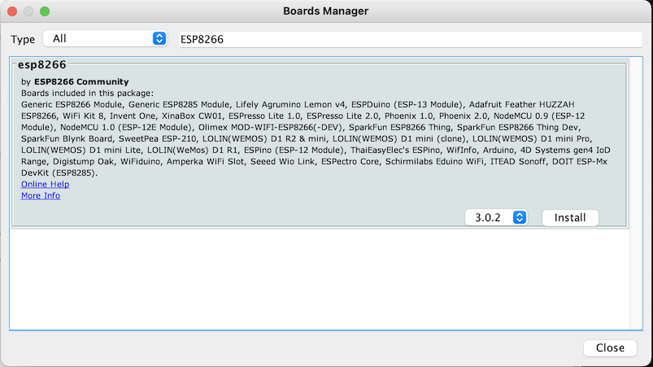
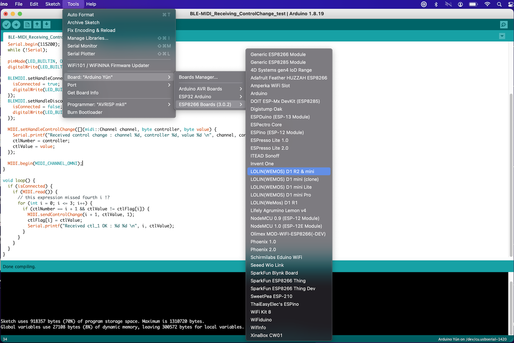

# 1. Install the Arduino Desktop IDE
## step 1
To get step-by-step instructions select one of the following link accordingly to your operating system.

- [Windows](https://docs.arduino.cc/software/ide-v1/tutorials/Windows)
- [MacOS](https://docs.arduino.cc/software/ide-v1/tutorials/macOS)
- [Linux](https://docs.arduino.cc/software/ide-v1/tutorials/Linux)

# 2. Install Driver for Wemos D1 mini v3 (ESP8266)
## step 2
- Start the Arduino IDE (you installed in #1)
- Open the Arduino Preferences:

- Additional Boards Manager URLs: 

  add: https://arduino.esp8266.com/stable/package_esp8266com_index.json

## Step 3
In the menus, go to Board manager... (Tools, Board, Board Manager...)

Search for ESP8266 and install (version 3.0.2)

Select `LONIN(WEMOS) D1 R2 & mini`

