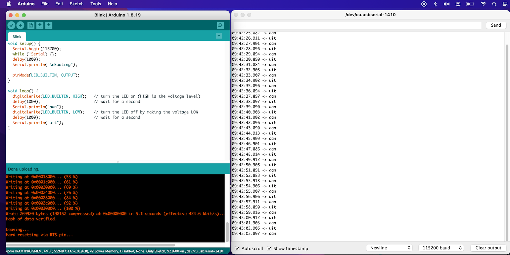

# LogWindow

aka Poor-mans-debugging

Monitor the serial output of the things and print it's output:

## Make the monitor visible

This can only be done after selecting the port


## Watch the messages go by:

I recommend selecting `Autoscroll` and `Show timestamp`




Sketch:

```cpp
void setup() {
  Serial.begin(115200);
  while (!Serial) {};
  delay(1000);
  Serial.println("\nBooting");

  pinMode(LED_BUILTIN, OUTPUT);
}

void loop() {
  digitalWrite(LED_BUILTIN, HIGH);   // turn the LED on (HIGH is the voltage level)
  delay(1000);                       // wait for a second
  Serial.println("aan");
  digitalWrite(LED_BUILTIN, LOW);    // turn the LED off by making the voltage LOW
  delay(1000);                       // wait for a second
  Serial.println("uit");
}
```


