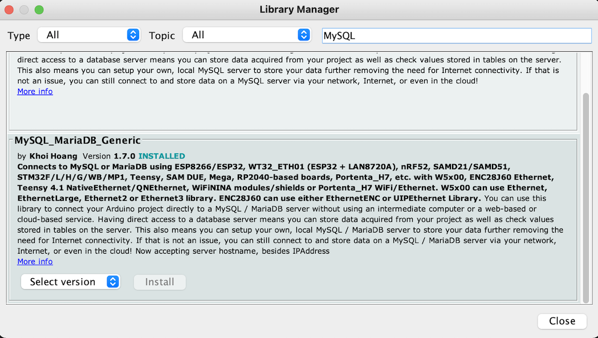

# Read and Transmit reading to a database

## What & where database??

A MariaDB is running on the Synology NAS. Connect using a TCP/IP connection:

```cpp
const IPAddress server(192, 168, 0, 105);
const uint16_t server_port = 3306;
```

A user has been defined on the database to interact with it:

```cpp
char user[]     = "flagis";      // MySQL user login username
char password[] = "Flagis2022_"; // MySQL user login password
```

### Communication between the Wemos and MariaDB

Use the MySQL library to talk `SQL` to the database




```cpp
  if (conn.connectNonBlocking(server, server_port, user, password) != RESULT_FAIL)
  {
    auto INSERT_SQL = String("INSERT INTO table")
                      + " (field1, field2) VALUES (1,2)";

    if ( !query_mem.execute(INSERT_SQL.c_str()) )
      Serial.println("Insert error");
    else
      Serial.println("Data Inserted.");

    Serial.println("Closing connection.");
    conn.close();
  }
  else
    Serial.println("nConnect failed. Trying again on next iteration.");
```