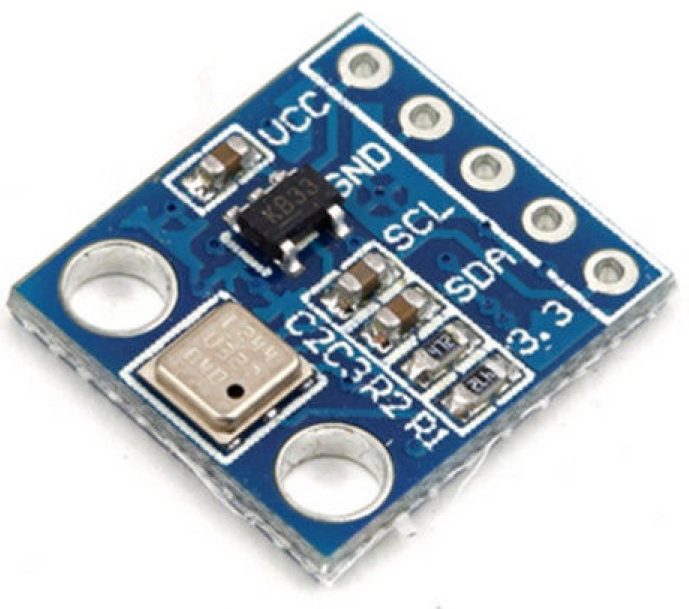
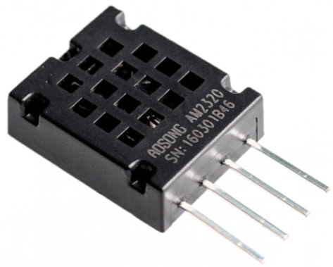
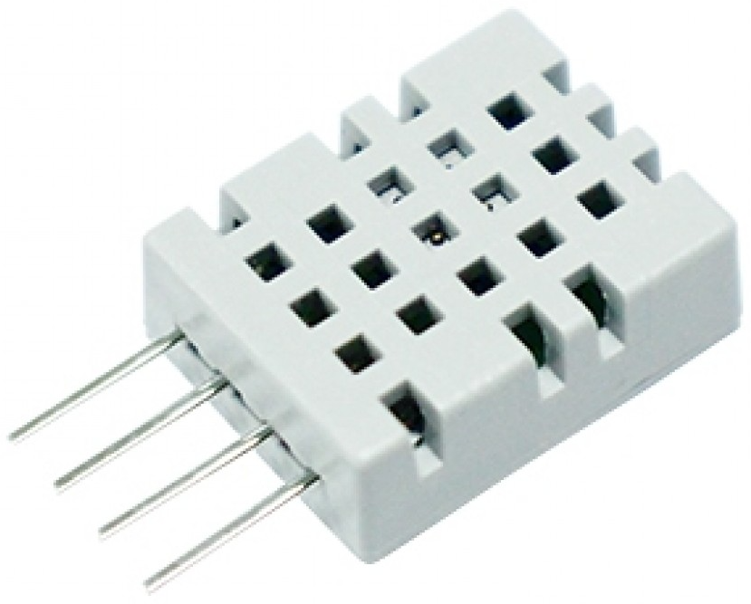
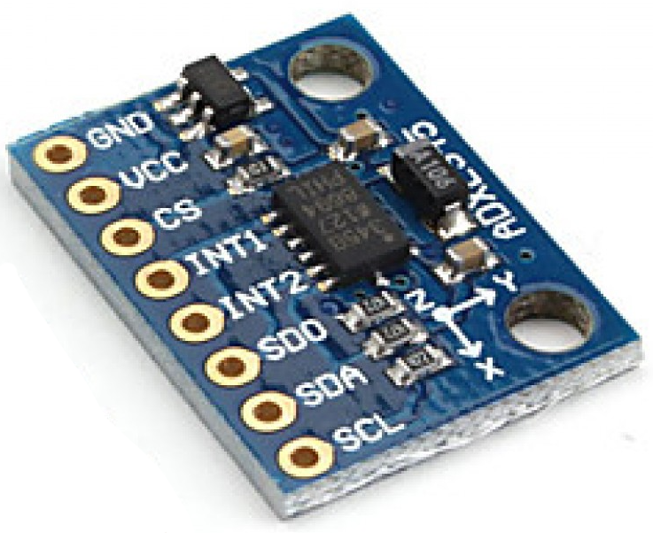

# Sensors & ObservedProperties

## Bending Sensor


### Sensor:
```javascript
{
  "name": "MB060-N-321-A01",
  "description": "The Flex sensor can be used to measure bending movements",
  "encodingType": "application/pdf",
  "metadata": "http://www.taiwanalpha.com/downloads?target=products&id=22"
}
```

### ObservedProperty:
```javascript
{
  "name": "AngleRange",
  "description": "Bending movements between 0 and 180 degrees",
  "definition": "https://en.wikipedia.org/wiki/Bending"
}
```

## Weighing Scale 

### Sensor:
```javascript
{
  "name": "",
  "description": "",
  "encodingType": "application/pdf",
  "metadata": ""
}
```

### ObservedProperty:
```javascript
{
  "name": "",
  "description": "",
  "definition": ""
}
```

## Axis Compass Magnetometer  

### Sensor:
```javascript
{
  "name": "",
  "description": "",
  "encodingType": "application/pdf",
  "metadata": ""
}
```

### ObservedProperty:
```javascript
{
  "name": "",
  "description": "",
  "definition": ""
}
```

## Digital Barometer  

### Sensor:
```javascript
{
  "name": "",
  "description": "",
  "encodingType": "application/pdf",
  "metadata": ""
}
```

### ObservedProperty:
```javascript
{
  "name": "",
  "description": "",
  "definition": ""
}
```

## Temperature and Humidity  

### Sensor:
```javascript
{
  "name": "",
  "description": "",
  "encodingType": "application/pdf",
  "metadata": ""
}
```

### ObservedProperty:
```javascript
{
  "name": "",
  "description": "",
  "definition": ""
}
```

## Gas Sensor 

### Sensor:
```javascript
{
  "name": "",
  "description": "",
  "encodingType": "application/pdf",
  "metadata": ""
}
```

### ObservedProperty:
```javascript
{
  "name": "",
  "description": "",
  "definition": ""
}
```

## Accelerometer  

### Sensor:
```javascript
{
  "name": "",
  "description": "",
  "encodingType": "application/pdf",
  "metadata": ""
}
```

### ObservedProperty:
```javascript
{
  "name": "",
  "description": "",
  "definition": ""
}
```

## xxxx 

### Sensor:
```javascript
{
  "name": "",
  "description": "",
  "encodingType": "application/pdf",
  "metadata": ""
}
```

### ObservedProperty:
```javascript
{
  "name": "",
  "description": "",
  "definition": ""
}
```

## yyy 

### Sensor:
```javascript
{
  "name": "",
  "description": "",
  "encodingType": "application/pdf",
  "metadata": ""
}
```

### ObservedProperty:
```javascript
{
  "name": "",
  "description": "",
  "definition": ""
}
```

## zzz 

### Sensor:
```javascript
{
  "name": "",
  "description": "",
  "encodingType": "application/pdf",
  "metadata": ""
}
```

### ObservedProperty:
```javascript
{
  "name": "",
  "description": "",
  "definition": ""
}
```
